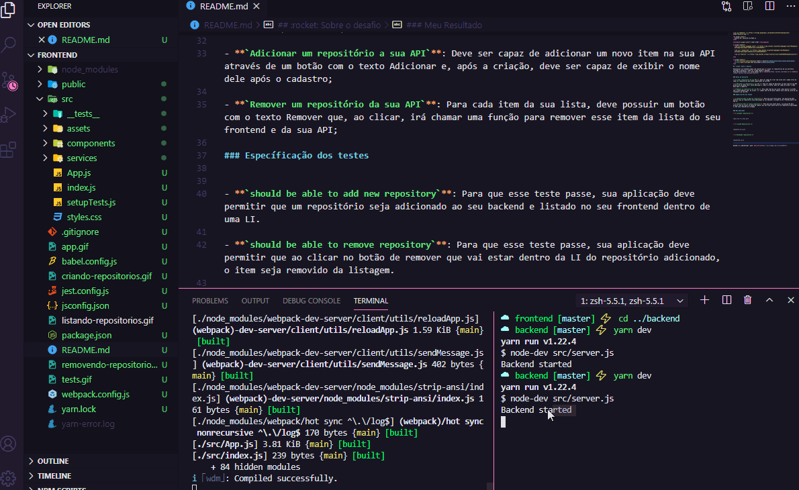
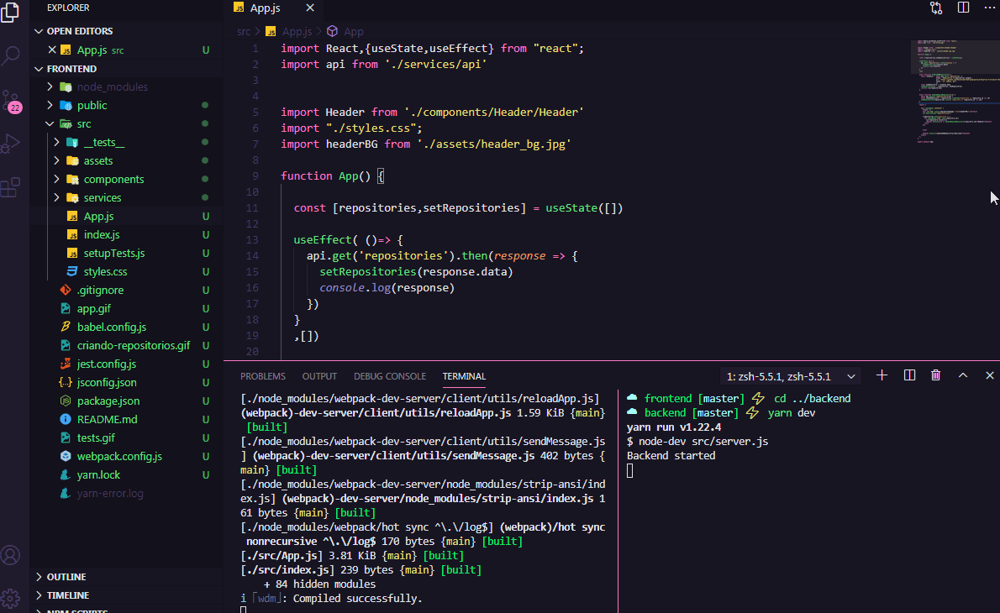
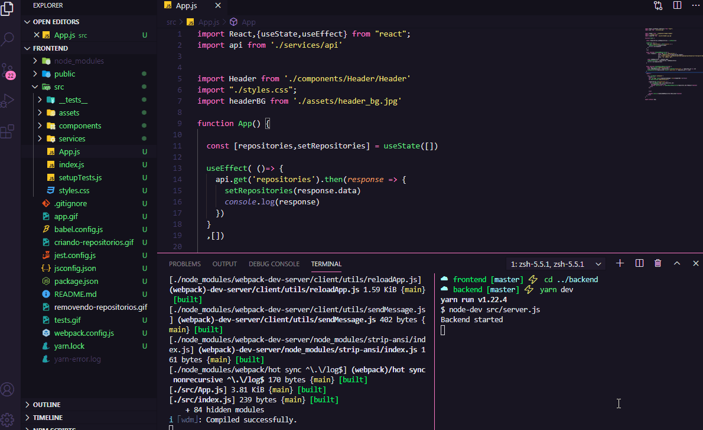
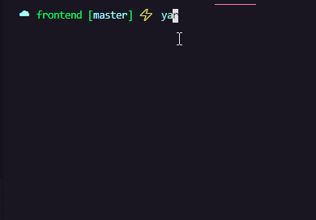

<h3 align="center">
  Desafio 02: Conceitos do ReactJS
</h3>

<blockquote align="center">“JUST START."</blockquote>

  

  

  

  <a href="#rocket-sobre-o-desafio">Sobre o desafio</a>&nbsp;&nbsp;&nbsp;|&nbsp;&nbsp;&nbsp;
  <a href="#meu-resultado">Meu Resultado</a>&nbsp;&nbsp;&nbsp;

## :rocket: Sobre o desafio

Desenvolver um frontend simple com reactJS que irá exibir os repositórios do seu portfólio iniciado no desafio 1 onde foi criado apenas o backend. 
Essa aplicação deverá ser feita apenas com o **[NodeJS](https://github.com/nodejs)** e **[React](https://github.com/facebook/react)**.

### Rotas da aplicação

- **`Listar repositórios da sua API`**: Deve ser capaz de criar uma lista com o campo title de todos os repositórios que estão cadastrados na sua API;

- **`Adicionar um repositório a sua API`**: Deve ser capaz de adicionar um novo item na sua API através de um botão com o texto Adicionar e, após a criação, deve ser capaz de exibir o nome dele após o cadastro;

- **`Remover um repositório da sua API`**: Para cada item da sua lista, deve possuir um botão com o texto Remover que, ao clicar, irá chamar uma função para remover esse item da lista do seu frontend e da sua API;

### Específicação dos testes

- **`should be able to add new repository`**: Para que esse teste passe, sua aplicação deve permitir que um repositório seja adicionado ao seu backend e listado no seu frontend dentro de uma LI.

- **`should be able to remove repository`**: Para que esse teste passe, sua aplicação deve permitir que ao clicar no botão de remover que vai estar dentro da LI do repositório adicionado, o item seja removido da listagem.

### Meu Resultado

- **`Listando repositórios`**: 

- **`Criando Repositórios`**: 

- **`Deletando repositórios`**

- **`Testes`**

Agradeço a 💜Rocketseat :wave: [Discord!](https://discordapp.com/invite/gCRAFhc)